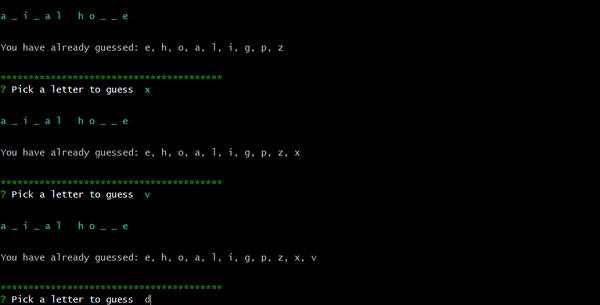

# commandLineWordGuess 
## Node.js powered command line word guess game

### First chose which genre of terms you would like to guess

### Then try to guess the letters! 
 - if you get is right: 

 

 - if you get it wrong too many times.... 

 

 - **Most** importantly, if you figure out all the words in the category you win.... 

 

 ### The right to play again! (no, there's really no other prizes)

 #### - Powered by Node.js, javascript, chalk, inquirer, and my own sheer willpower. Enjoy!